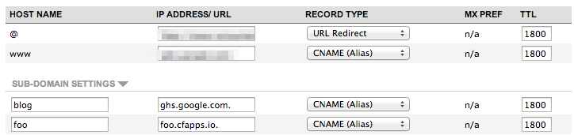

## Custom Domains Overview ##

Cloud Foundry v2 supports using custom domains that have been registered with a 3rd party domain registrar. This involves updating the custom domain name server records (typically a CName) and configuring the domain in Cloud Foundry and associating it with an application.

## Update Name Servers ##

The first step is to push an application and assign a subdomain from the default Cloud Foundry domain such as foo.cfapps.io. Once foo.cfapps.io is assigned, you should create a CName in your domain registrar and point it at the domain you configured previously.

The example below illustrates configuring a foo subdomain for a custom domain with a CName aliased to foo.cfapps.io.

</img>

It is recommended to confirm the domain resolves correctly by using `nslookup` on the domain. It may take a few minutes for the name servers to update. It may help to flush your local machine's DNS cache.

On OSX 10.7/10.8, you can use `sudo killall -HUP mDNSResponder` 
On Windows, you can using `ipconfig /flushdns` 

## Map Domain and Route ##

Once the name servers are configured with the registrar, you should use the `cf map-domain` command to map the domain to the organization and space and subsequently use the `cf map` command to map a route using that custom domain to the application. For example, let's say there is a domain `somedomain.com`, an app named `sinatra-hello` and a route named `foo.somedomain.com`. The following commands will complete the registration so that somedomain.com will map to the current organization and space and foo.somedomain.com routes to the application. 

    cf map-domain somedomain.com
    cf map sinatra-hello foo somedomain.com
	cf sinatra-hello restart

*Note the restart command, if the application is already running the new route will not be active until the application is restarted*

